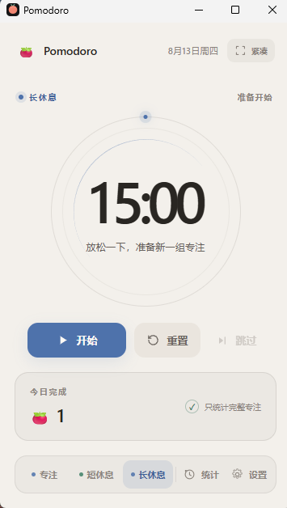
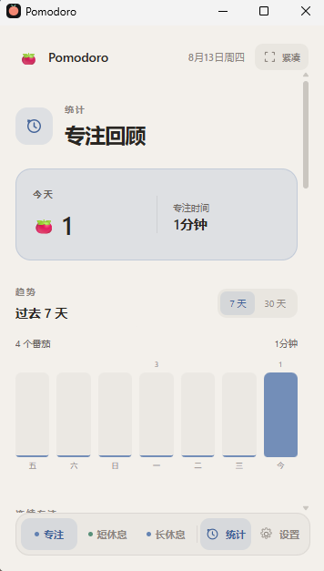
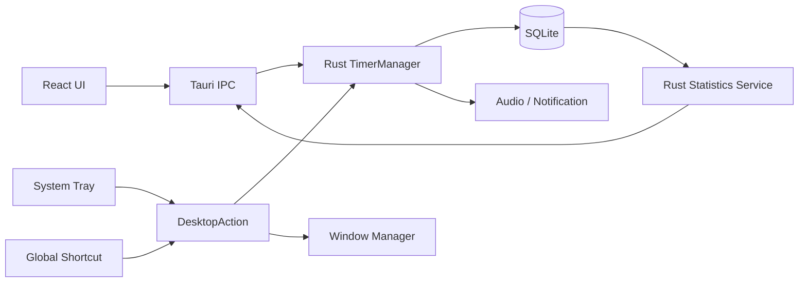

# Pomodoro Desktop

一个轻量、可靠、专注于桌面体验的 Windows 番茄钟。

支持 Focus / Short Break / Long Break、Statistics，以及 System Tray、Global Shortcut、Compact Mode 和多主题外观。
桌面版由 Rust 维护权威 Timer 状态，React/WebView 负责界面与交互。

Built with Tauri 2 + React + TypeScript + Rust.


_English version coming later._

运行中的计时器保存目标结束时间，并根据系统时间持续校准；窗口隐藏、WebView 暂停或系统短暂休眠后，应用会重新协调计时状态，减少后台节流造成的累计误差。

当前版本不需要账号或服务器，专注记录与设置保存在本地。

## ✨ 功能特点

### Timer

- Focus、Short Break、Long Break 三种模式
- 默认 `25 / 5 / 15` 分钟，长休息默认每 4 个完整 Focus 触发
- Focus 1–120 分钟、休息 1–60 分钟、长休息间隔 2–8 次可配置
- 开始、暂停、继续、重置与跳过
- 可选自动开始休息和下一轮 Focus
- 手动重置不会计入完成统计，Skip 会保留为独立 Session

### Reliable Desktop Timer

- Rust `TimerManager` 维护桌面版权威状态
- 基于 target-end-time 和 wall clock 计算剩余时间
- 运行中与暂停状态均可持久化并在重启后恢复
- 从休眠或后台状态返回时自动 reconcile
- Session 完成与统计写入采用唯一完成事件和原子持久化，避免重复计数

### Statistics

- 今日完成番茄与专注时间
- 过去 7 天 / 30 天趋势
- Current Streak 与 Longest Streak
- All Time 总番茄、总专注时间和专注天数
- 今日记录、每日汇总和最近 Session

### Desktop Experience

- System Tray 状态展示与计时控制
- Windows 完成通知
- 原生完成提示音、音量调节与试听
- 全局快捷键
- Compact Mode
- Always On Top
- 关闭到托盘、最小化到托盘
- 标准与紧凑窗口分别保存位置和尺寸，并处理多显示器与 DPI 变化

### Appearance

- Dark、Light、System 三种主题模式
- Rose、Mint、Blue 三种强调色
- System 模式实时跟随 Windows 明暗主题
- 支持键盘焦点样式与 `prefers-reduced-motion`

## 🖼️ Screenshots

| Timer · Long Break | Statistics · 7 Days |
| :---: | :---: |
|  |  |

## 📦 下载

当前最新稳定版本：[`v0.4.0`](https://github.com/cyenxandy-lgtm/pomodoro-desktop/tree/v0.4.0)

Windows 安装包将在 [GitHub Releases](https://github.com/cyenxandy-lgtm/pomodoro-desktop/releases) 中提供。当前尚未创建正式 Release，请勿将源码归档当作安装包。

## 💻 系统要求

当前发行与主要测试平台为 Windows：

- Windows 10 / 11
- x64
- Microsoft Edge WebView2 Runtime

项目暂未发布 macOS 或 Linux 安装包。

## ⌨️ 全局快捷键

| 快捷键 | 操作 |
| --- | --- |
| `Ctrl + Alt + Space` | 开始 / 暂停 / 继续 |
| `Ctrl + Alt + R` | 重置 |
| `Ctrl + Alt + S` | 跳过当前阶段 |
| `Ctrl + Alt + P` | 显示 / 隐藏窗口 |

快捷键默认开启，可在设置中关闭。如果组合键已被其他程序占用，Pomodoro 会继续运行，并在设置页列出不可用的快捷键。

## 📊 统计口径

统计以自然完成的 Focus Session 为基础：

- 完整 Focus 计入番茄数量与专注时间
- Reset 产生的 cancelled Session 不计入 Focus 统计
- Skip 产生的 skipped Session 不计入番茄数量与专注时间
- Short Break 和 Long Break 不计入 Focus 统计
- 趋势与 Streak 按本地日期汇总

## 🔒 数据与隐私

Pomodoro Desktop 当前是本地优先应用：

- Session、活动计时器和番茄循环状态保存在本地 SQLite
- 设置与界面偏好保存在 WebView 本地存储
- 窗口位置、尺寸和桌面窗口状态保存在本地 JSON
- 没有账号系统或云同步服务
- 当前版本不会将 Pomodoro Session 数据上传到项目服务器
- 当前代码与依赖中没有内置遥测或分析服务

桌面数据使用 Tauri 提供的应用数据目录。浏览器开发模式使用浏览器 `localStorage`，不会提供完整的原生桌面集成。

## 🏗️ 架构



React 负责界面、偏好设置与状态投影；Tauri IPC 将用户操作发送给 Rust。Timer、Session 完成判断和桌面动作共享同一套 Rust 状态，统计服务从 SQLite 聚合数据后返回 React 展示。

开发服务器在非 Tauri 环境下会使用 `WebTimerService` 和 `localStorage` fallback，便于调试 UI 与基础计时。Tray、全局快捷键、原生通知、Rust SQLite 统计等能力仅在桌面运行时提供。

## Why Rust Timer?

浏览器中的 `setInterval()` 更适合驱动 UI 刷新，不适合作为唯一时间来源：WebView 后台节流、系统休眠或主线程卡顿都可能延迟回调。

桌面版运行时保存 `targetEndTime`，每次状态协调都通过当前 wall clock 重新计算剩余时间；暂停时保存剩余时长，继续时生成新的目标结束时间。应用重启后会从 SQLite 恢复活动状态，过期 Timer 则通过 reconcile 完成收口，不凭空补跑多个周期。

## 🧰 技术栈

| 层级 | 技术 |
| --- | --- |
| Desktop Runtime | Tauri 2 |
| Frontend | React 19、TypeScript、Vite |
| Native Core | Rust 2021 |
| Persistence | SQLite（rusqlite bundled）|
| Desktop Integration | Tauri Tray、Notification、Global Shortcut |
| Audio | rodio |
| Testing | Vitest、Testing Library、Rust tests |
| Quality | TypeScript strict mode、Oxlint、rustfmt、Clippy |

## 🛠️ 本地开发

### 开发环境

- Node.js `^20.19.0` 或 `>=22.12.0`
- npm
- Rust `1.77.2` 或更高版本
- Windows MSVC Build Tools
- Microsoft Edge WebView2

### 获取项目

```bash
git clone https://github.com/cyenxandy-lgtm/pomodoro-desktop.git
cd pomodoro-desktop
npm install
```

启动 Tauri 桌面开发模式：

```bash
npm run dev:tauri
```

只启动浏览器前端预览：

```bash
npm run dev
```

浏览器模式用于前端开发，不代表完整 Windows Desktop 行为。

## 📦 构建

构建前端静态资源：

```bash
npm run build
```

构建 Windows Release 可执行文件与 NSIS 安装包：

```bash
npm run build:tauri
```

产物位于 `src-tauri/target/release/`，NSIS 安装包位于其 `bundle/nsis/` 子目录。`target/` 是生成目录，不应提交到源码仓库。

## 🧪 测试

前端检查：

```bash
npm run test
npm run lint
npm run build
```

Rust 检查：

```bash
cd src-tauri
cargo fmt --all -- --check
cargo check
cargo test
cargo clippy --all-targets --all-features -- -D warnings
```

自动测试覆盖 Timer 状态机、完成幂等性、SQLite migration、统计聚合、Tray/Shortcut action、窗口恢复、主题和持久化边界。

## 🧪 隔离测试环境

项目提供显式 Test Profile，用独立目录隔离：

- SQLite 与 WAL/SHM
- Window State
- WebView2 Storage
- 测试专用 `localStorage` key

先构建 Release，再启动 10/5/5 秒的手动验收 Profile：

```powershell
npm run build:tauri
powershell -ExecutionPolicy Bypass -File .\scripts\run-test-profile.ps1 `
  -ProfileName manual-acceptance -SmokeTimer
```

脚本会设置 `POMODORO_TEST_PROFILE` 等测试环境变量，并将数据限制在 `.test-data/<profile>`。安全清理脚本要求有效 marker，且检测到工作区内 Pomodoro 进程时会拒绝删除：

```powershell
powershell -ExecutionPolicy Bypass -File .\scripts\cleanup-test-profile.ps1 `
  -ProfileName manual-acceptance
```

完整人工验收项目见 [`MANUAL_RELEASE_CHECKLIST.md`](./MANUAL_RELEASE_CHECKLIST.md)。

## 📁 项目结构

```text
src/
├── components/       # Timer、Statistics、Settings UI
├── domain/           # Timer、Session、Statistics 类型与规则
├── hooks/            # React 状态与生命周期衔接
├── repositories/     # Session repository adapters
├── services/         # Tauri/Web runtime services
├── styles/           # Theme 与视觉变量
└── utils/            # Storage、日期与格式化

src-tauri/
└── src/
    ├── timer/        # Rust Timer domain、core 与 runtime
    ├── db/           # SQLite schema、migration 与 repository
    ├── statistics.rs # Statistics query service
    ├── desktop.rs    # Tray 与 desktop actions
    ├── shortcuts.rs  # Global shortcuts
    └── window_state.rs

scripts/              # Sound generation 与隔离 Test Profile
```

## 🗺️ Roadmap

- [x] Rust 权威 Timer 与重启恢复
- [x] SQLite Session 与 Statistics
- [x] Tray、Notification、Global Shortcut
- [x] Compact Mode、Always On Top、Window Restore
- [x] Dark / Light / System 与多强调色
- [ ] 扩展真实 Windows 使用验证
- [ ] v1.0 Release Candidate

## 🚧 项目状态

当前版本为 `v0.4.0`，仍处于 pre-1.0 与真实使用验证阶段。主要开发、构建和验收平台为 Windows x64。

## 🙏 Acknowledgements

Product and UX inspiration includes [Pomotroid](https://github.com/Splode/pomotroid). Pomodoro Desktop 保持独立的产品设计、视觉实现与代码架构。
